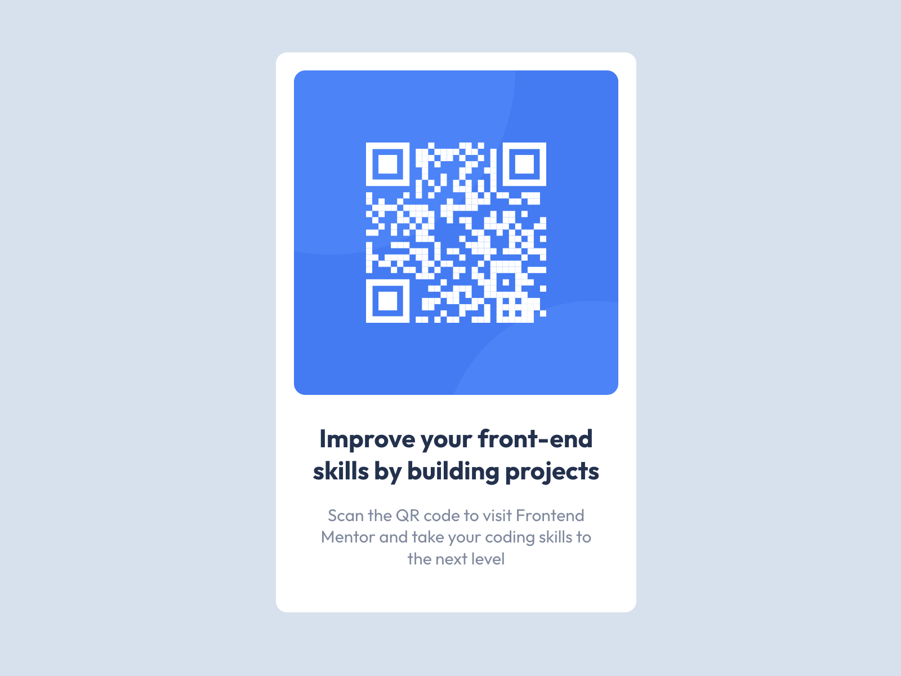

# Desafio: Qr-code

Essa é uma aplicação simples, só mais visual mesmo, eu resolvi fazer esse desafio, para treinar meu conhecimento em **React**. Resolvi começar pelo simples! Sem aplicações complexas, depois vou evoluindo os desafios...

- Esse desafio é lá do Frontend-mentor!

  
  
  <h3>Qr-code</h3>
    

 
## Link dele rodando ao vivo e em todas as telas! 

Clique [neste link azul](), para poder ter acesso ao site.